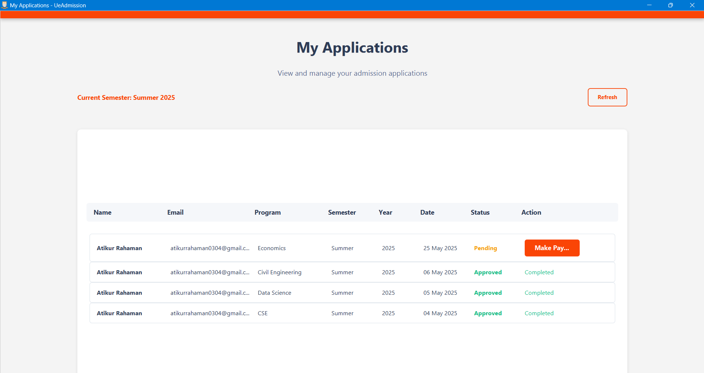

# U-eAdmission Online System

## 🚀 Project Overview

The U-eAdmission Online System is a comprehensive JavaFX application designed to streamline and automate the entire university admission process. It handles every step from application submission to admission offer generation with an integrated testing and evaluation system.

## ✨ Key Features

- **User Authentication & Role-Based Access**: Secure login system with dedicated dashboards for students and administrators
- **Student Registration & Application**: Online form submission with document uploads and status tracking
- **MCQ-Based Admission Test**: Fully automated examination with timer and auto-submit
- **Anti-Cheating System**: Webcam monitoring, screen tracking, and tab-switching prevention
- **Question Bank Management**: Category-wise question organization with automatic paper generation
- **Automated Results**: Instant score calculation, ranking, and merit list generation
- **Admission Offer System**: Automated seat allocation based on merit
- **Role-Specific Dashboards**: Custom interfaces for students and administrators
- **Notification System**: Email/SMS alerts for deadlines, exam schedules, and results
- **Exam Portal**: Online admission testing with instant feedback
- **Live Support**: In-app chat system for real-time communication between students and administrators
- **Standalone Chat Server**: Support for multiple application instances connecting to a single chat server

## 📸 Screenshots

### Home Screen


<details>
  <summary><b>Show More Screenshots</b></summary>

### Additional Home Screen Views


</details>

### Registration Screen


### Login Screen


### About Screen


### Contact Screen


<details>
  <summary><b>Show More Contact Screenshots</b></summary>

### Additional Contact Screen Views


</details>

### Admission Screen


<details>
  <summary><b>Show More Admission Screenshots</b></summary>

### Additional Admission Screen Views


</details>

### User Profile Screen


### Application Screen



### Chat System


<details>
  <summary><b>Show More Chat Screenshots</b></summary>

### Additional Chat System Views


</details>

For detailed information about the chat system, including how to run the standalone chat server and configure the chat system, please refer to the [Chat System Documentation](README-CHAT.md).

## 🎬 Demo Videos

You can view all demo videos in this YouTube playlist: [Click Here](https://www.youtube.com/playlist?list=PLAx69bW5jdxy166ou_cxcnilEsfeJcDrH)

### Admin Login Demo

https://github.com/user-attachments/assets/7efe35cc-1f5f-4181-82ac-e3400ee76fcf

### Student Login Demo

https://github.com/user-attachments/assets/0d5d2956-f818-42c3-bb8e-b53ef8558ede

### Student Registration Demo

https://github.com/user-attachments/assets/66ad1f9d-0fab-46f4-a57c-f1cbc99951e1

### Application and Payment Process Demo

https://github.com/user-attachments/assets/e63f30b4-4c4e-4b9c-82a4-31008c1d5175

### Chat System Demo

https://github.com/user-attachments/assets/ac55f256-61a3-4b03-820f-6400489a019c

## 🛠️ Technologies

The U-eAdmission Online System is built using the following technologies:

- **Java 21**: Core programming language
- **JavaFX**: GUI framework for building the desktop application
- **MySQL**: Database for storing application data, user information, and test questions
- **JDBC**: Java Database Connectivity for database operations
- **Maven**: Dependency management and build automation
- **CSS**: Custom styling for the UI components
- **WebRTC**: Implementation for video meeting functionality
- **JavaMail API**: Email notification system
- **Git**: Version control system

## 🔧 Installation & Setup

### Prerequisites

- Java Development Kit (JDK) 21 or higher
- JavaFX SDK 21 or higher
- Maven (for dependency management)

### Steps to Run

1. Clone the repository:

   ```
   git clone https://github.com/Atik203/U-eAdmission-Online-System.git
   ```

2. Navigate to the project directory:

   ```
   cd U-eAdmission-Online-System
   ```

3. Compile the project:

   ```
   mvn clean compile
   ```

4. Run the application:
   ```
   mvn javafx:run
   ```

## 📂 Project Structure

```
U-eAdmission/
├── img/                       # Screenshots and images
├── lib/                       # External libraries and dependencies
├── README-CHAT.md             # Chat system documentation
├── src/
│   ├── main/
│   │   ├── java/
│   │   │   ├── module-info.java
│   │   │   └── com/
│   │   │       └── ueadmission/
│   │   │           ├── BaseController.java
│   │   │           ├── Main.java
│   │   │           ├── MainController.java
│   │   │           ├── about/                 # About page functionality
│   │   │           ├── admin/                 # Admin dashboard and features
│   │   │           ├── admission/             # Admission process handling
│   │   │           ├── application/           # Application form and processing
│   │   │           │   ├── model/             # Application data models
│   │   │           │   └── service/           # Application services
│   │   │           ├── auth/                  # Authentication and user management
│   │   │           │   ├── session/           # User session handling
│   │   │           │   └── state/             # Authentication state management
│   │   │           ├── chat/                  # Chat functionality
│   │   │           ├── components/            # Reusable UI components
│   │   │           ├── contact/               # Contact page functionality
│   │   │           ├── context/               # Application context management
│   │   │           ├── db/                    # Database connection and operations
│   │   │           ├── navigation/            # Navigation utilities
│   │   │           ├── payment/               # Payment processing
│   │   │           ├── profile/               # User profile management
│   │   │           ├── student/               # Student-specific functionality
│   │   │           └── utils/                 # Utility classes
│   │   └── resources/
│   │       ├── com.ueadmission/              # FXML, CSS, and other resources
│   │       │   ├── about/
│   │       │   ├── admin/
│   │       │   ├── admission/
│   │       │   ├── application/
│   │       │   ├── auth/
│   │       │   ├── chat/
│   │       │   ├── components/
│   │       │   ├── contact/
│   │       │   ├── images/
│   │       │   ├── payment/
│   │       │   ├── profile/
│   │       │   └── student/
│   │       └── database/                     # SQL database scripts
│   └── test/
│       └── java/                             # Test classes
├── target/                                   # Compiled output
├── video/                                    # Demo videos
│   ├── AdminLogin.mp4
│   ├── StudentLogin.mp4
│   └── StudentRegistration.mp4
├── pom.xml                                   # Maven project configuration
└── README.md                                 # Project documentation
```

## 🤝 Contributing

We welcome contributions to the U-eAdmission Online System! This section outlines the process for contributing to this project.

### Branch Structure

This project maintains two primary branches:

- `main`: Production-ready code that has been thoroughly tested and validated
- `dev`: Testing phase branch where all new features are integrated before promotion to `main`

### Contribution Process

1. **Fork the Repository**: Start by forking the repository to your GitHub account.

2. **Create a Feature Branch**:

   ```
   git checkout -b <your-name>/<feature-name>
   ```

   Name your branch using either your name or a descriptive feature name.

3. **Make Your Changes**: Implement your feature or bug fix.

4. **Follow Coding Standards**: Ensure your code follows the project's coding standards and includes appropriate tests.

5. **Commit Your Changes**: Use clear and descriptive commit messages.

   ```
   git commit -m "Add detailed description of the changes"
   ```

6. **Push to Your Fork**:

   ```
   git push origin <your-name>/<feature-name>
   ```

7. **Submit a Pull Request**: Create a pull request from your feature branch to the `dev` branch of the main repository.

8. **Code Review Process**: Your PR will be reviewed by the project maintainers.

9. **Merge Workflow**: After approval, your changes will be merged into the `dev` branch. The project maintainer will periodically merge `dev` into `main` for production releases.

### Pull Request Guidelines

- Provide a clear description of the changes in your PR
- Include any relevant issue numbers in the PR description
- Ensure all tests are passing
- Update documentation if necessary

Thank you for contributing to make the U-eAdmission Online System better!

## 👥 Team Members

- [Md. Atikur Rahaman](https://github.com/Atik203) - **Team Leader**
- [Sagor Ahmed](https://github.com/SASagorAhmed)
- [Md. Salman Rohoman Nayeem](https://github.com/Md-Salman-Rahman339)
